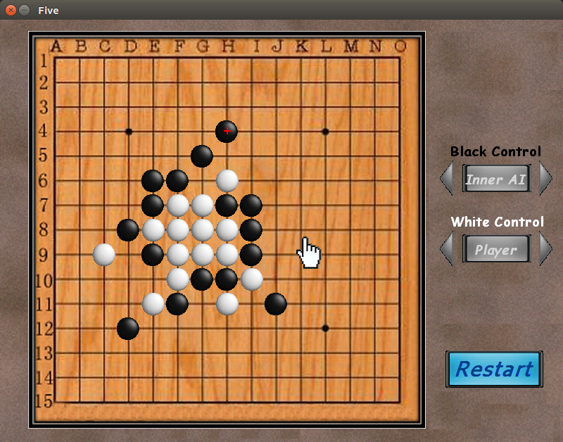

This is a Gobang game (aka. Gomoku, Five-in-a-Row, or "五子棋") implemented with C++ and [SDL](http://libsdl.org/).

It provides a bundled bot (simple but not easy :smile:) and an API for developing your bots.

